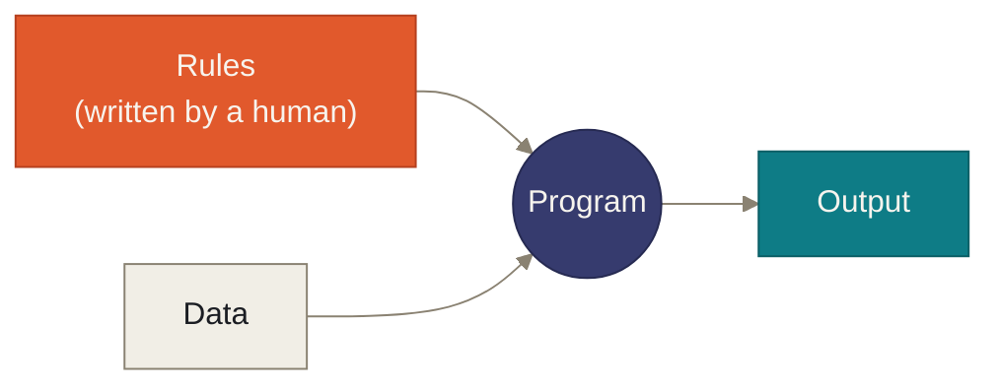
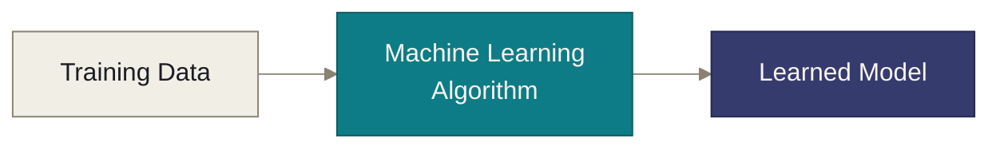
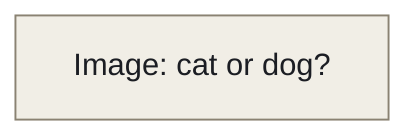
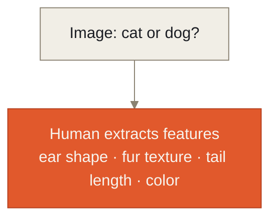
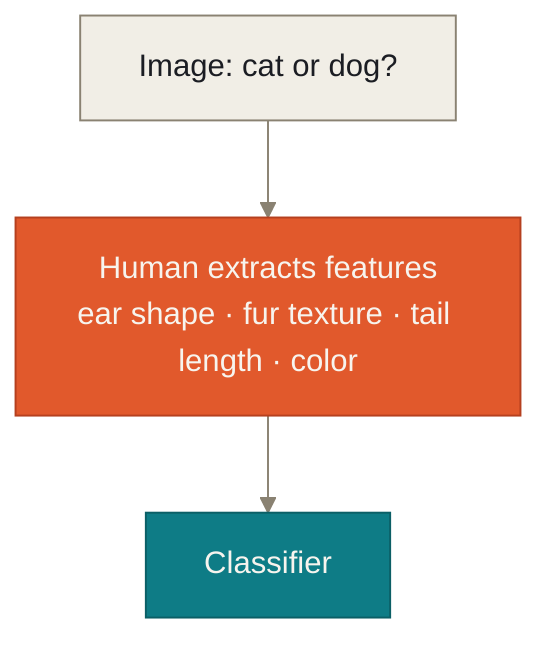
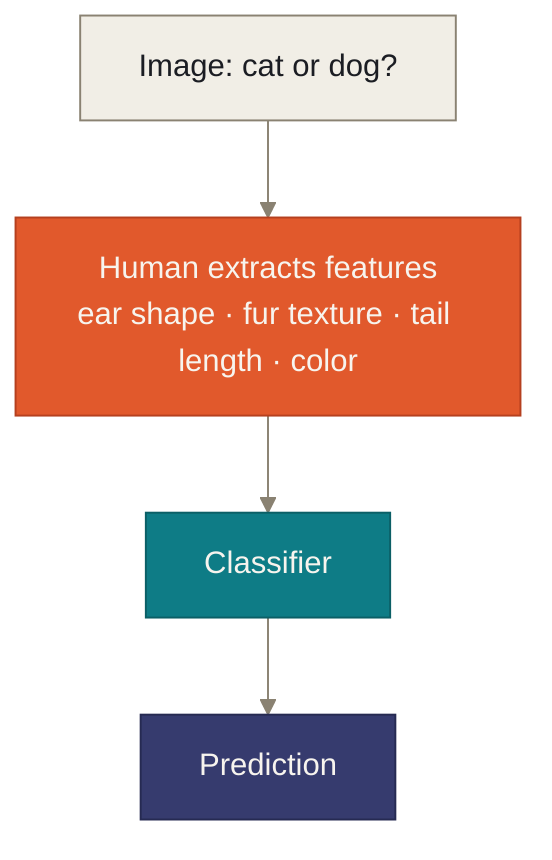

# Chapter 1

## Why Machine Learning?

<div v-click class="thesis" style="margin-top:0.8em">Some problems can't be solved by writing rules — no matter how clever the rules are.</div>

<!--
This is a pure orientation slide — say the thesis line out loud, then move on
within 20 seconds. Don't unpack it yet; the next slides will do that.

Transition: "To see why, let's start with how computers were programmed
before any of this existed."
-->

---
chapter: '1 · Why Machine Learning?'
layout: two-cols-header
clicks: 9
---

# Traditional programming — and where it breaks down

::left::

<span v-click class="eyebrow why">Symbolic Representation · Expert Systems</span>

<div v-click class="key-message" style="font-size:0.92rem">A traditional program is just human-written rules applied to data.</div>

<div v-click>



</div>

<div v-click class="example-box">

```text
IF Marks > 40
      Pass
ELSE
      Fail
```

</div>

<div v-click class="transition-line" style="font-size:0.78rem">Works — <span class="arrow">but only when a human already knows the rule.</span></div>

::right::

<div v-click class="key-message" style="font-size:0.92rem">Perceptual problems have no finite list of IF-statements that covers them.</div>

<div v-click class="task-grid">
  <div class="task-chip">Face recognition</div>
  <div class="task-chip">Speech recognition</div>
  <div class="task-chip">Handwriting recognition</div>
  <div class="task-chip">Language translation</div>
  <div class="task-chip">Medical diagnosis</div>
</div>

<div v-click class="rule-attempt">
  <div>IF eye_size &gt; x  →  Person A</div>
  <div>IF nose_length &gt; y  →  Person B</div>
  <div class="rule-attempt-verdict">✕ &nbsp;No.</div>
</div>

<div v-click class="key-message" style="margin-top:0.5em; font-size:0.85rem;">
Because of lighting, pose, expression, camera angle, and occlusion — the same face never produces the same numbers twice.
</div>

<style>
.task-grid { display: flex; flex-wrap: wrap; gap: 0.4em; margin: 0.6em 0; }
.task-chip {
  padding: 0.3em 0.75em; border-radius: 999px;
  background: var(--ann-paper-raised); border: 1px solid var(--ann-line);
  font-size: 0.76rem; font-family: 'Space Grotesk', sans-serif;
}
.rule-attempt {
  font-family: 'JetBrains Mono', monospace; font-size: 0.8rem;
  background: var(--ann-ember-soft); border-left: 4px solid var(--ann-ember);
  border-radius: 0.5em; padding: 0.6em 0.9em; display: inline-block;
}
.rule-attempt-verdict { margin-top: 0.35em; font-weight: 700; color: var(--ann-ember); font-family: 'Space Grotesk', sans-serif; }
</style>

<!--
[Merged from two slides: "Traditional programming: rules, written by hand"
+ "Where rules quietly stop working". Every block, including the eyebrow
and diagram, now arrives on its own click (9 total) — left column first,
then right column.]

Click 1 (eyebrow): a quick verbal frame — "this is the classic symbolic,
rule-based approach to AI: expert systems."

Click 2 (key-message): "Before any of this Machine Learning or Neural
Network business, here is how software was built for decades: a human sits
down, thinks hard about the problem, and writes down explicit rules. The
computer just executes them."

Click 3 (diagram): trace Rules + Data → Program → Output.

Click 4 (example box): walk the pass/fail example — marks above 40 pass,
otherwise fail. Trivial, because the rule is genuinely simple and the
person writing it already knows it with certainty. Ask the class: "Where
does this approach break? Not 'is it wrong' — ask instead: when does a
human simply not *have* the rule to write down?"

Click 5 (transition line): "This works — but only when a human already
knows the rule." Let a few answers land before revealing it. Transition
into the right column: "Let's look at a category of problems where nobody
can write that rule down — no matter how long they think about it."

Right column — click 6 (key-message): perceptual problems have no finite
list of IF-statements that covers them.

Click 7 (task grid): list the five example tasks quickly — these are all
tasks students will recognize as "AI" in the colloquial sense. The point:
all five share one property — a human perceives the answer effortlessly
but cannot *state the rule* they used.

Click 8 (rule-attempt box): read it half-seriously — "Could we write: if
eye size is bigger than some threshold, it's Person A? Obviously not — but
it's worth spelling out why not, precisely."

Click 9 (final key-message): enumerate the sources of variation — lighting,
pose, expression, camera angle, occlusion. Ask: "For any finite set of
rules you write, can you think of a photo that breaks it?" Someone will
always be able to — the rule set would need to be effectively infinite.

Likely student question: "But couldn't we just add more rules to cover more
cases?" Answer: "You can always add one more rule for one more photo. What
you can never do is add enough rules to cover *all* photos — the space of
variation is not just large, it's unbounded in practice." This is exactly
the misconception the next slide's callout will name explicitly, so you can
foreshadow it here.

Transition: "So if we can't write the rules ourselves — what's left?"
-->

---
chapter: '1 · Why Machine Learning?'
clicks: 3
---

# Machine Learning — and what it already solves

<span class="eyebrow intuition">Intuition</span>

<div v-click class="key-message">Instead of programming knowledge in ML, we learn knowledge from data.</div>

<div v-click class="transition-line"><b>Rules</b> became <b>Data</b>, and the <b>Program</b> became an <b>Algorithm</b> that produces a <b>Model</b>.</div>

<div v-click>




</div>

<div v-click>

<div class="eyebrow practice" style="margin-top:0.6em">In practice</div>

<div class="algo-grid">
  <div class="algo-chip">Linear Regression</div>
  <div class="algo-chip">Logistic Regression</div>
  <div class="algo-chip">Decision Trees</div>
  <div class="algo-chip">SVM</div>
  <div class="algo-chip">Random Forest</div>
  <div class="algo-chip">k-NN</div>
</div>

</div>

<div v-click class="key-message">These work extremely well — but most of them lean on features a <b>human</b> designed by hand.</div>

<style>
.algo-grid { display: flex; flex-wrap: wrap; gap: 0.5em; margin: 0.4em 0; }
.algo-chip {
  padding: 0.35em 0.9em; border-radius: 0.5em;
  background: var(--ann-circuit-soft); color: var(--ann-circuit);
  border-left: 3px solid var(--ann-circuit);
  font-family: 'Space Grotesk', sans-serif; font-weight: 600; font-size: 0.85rem;
}
</style>

<!--
[Merged from two slides: "Machine Learning: learn the rules from examples"
+ "Traditional ML already solves a lot".]

This is the pivot of the whole chapter, so state it plainly: "Researchers
flipped the traditional programming picture. Instead of a human supplying
the rules directly, the human supplies examples — and an algorithm figures
out the rule that fits them."

Point explicitly back at the Traditional Programming diagram from the
previous slide and map it piece by piece onto this one, out loud, before
revealing click 1 — it's good if students say the mapping before you show
it. This is literally "the birth of Machine Learning."

Likely question: "Isn't the algorithm itself still just rules someone
wrote?" Answer: "Yes, the *learning algorithm* is hand-written. What is
*not* hand-written is the model's actual decision boundary — the specific
weights or thresholds that come out of training."

Click 2 (algorithm chips): these are the ones covered in prior lectures, so
don't re-teach them — just name them and let students nod in recognition:
"You already know all of these."

Click 3 (key-message): land the hinge point of the whole chapter — read it
slowly, emphasize "human." Likely question: "What does 'lean on
hand-designed features' actually mean?" The next slide makes it concrete
with cats vs. dogs.

Transition: "Let's see exactly what that hand-designing looks like, and
where it starts to hurt."
-->

---
chapter: '1 · Why Machine Learning?'
---

# The hidden step: Feature Engineering

<span class="eyebrow intuition">Intuition</span>

<div v-click class="key-message">Someone has to decide, by hand, which measurements matter.</div>

<v-switch>
<template #1>



</template>
<template #2>



</template>
<template #3>



</template>
<template #4>



</template>
</v-switch>

<!-- <div v-click class="transition-line">The classifier is only as good as the features a <b>human</b> thought to hand it. <span class="arrow">This step is called <b>Feature Engineering.</b></span></div> -->

<!--
This diagram now builds one node per click — walk it left to right with the
cats-vs-dogs example, pausing at each click instead of describing the whole
pipeline at once.

Click 1 (Image): "We start with a raw image. On its own, a computer just
sees a grid of pixel numbers — nothing a classifier can use directly."

Click 2 (Human extracts features): "A human has to step in here and decide,
by hand, which measurements matter — ear shape, fur texture, tail length,
color — then actually compute those numbers from the image." This is the
step to slow down on; it's the hinge of the whole slide.

Click 3 (Classifier): "Only *those* hand-picked numbers — not the image
itself — get handed to the classifier."

Click 4 (Prediction): "The classifier does its job and produces cat or
dog." Now the full pipeline is on screen at once — use this moment to ask:
"What happens if the human picks the wrong features? Say, they forget that
whisker length matters?" Answer: the classifier can never recover that
information — it never saw it. The ceiling on model performance is set by
the human's feature choices, not by the classifier's cleverness.

Name the term explicitly and write it if you have a whiteboard: "Feature
Engineering." This is the term students should be able to define crisply
after this slide: the manual process of deciding and computing which
measurements from raw data are handed to a model.

Transition: "Feature engineering is fine when there are four obvious
features. What happens when there are thousands, and none of them are
obvious?"
-->

---
chapter: '1 · Why Machine Learning?'
clicks: 4
---

# Feature engineering doesn't scale

<span class="eyebrow why">Why</span>

<table>
  <thead>
    <tr>
      <th></th>
      <th>Simple data</th>
      <th>Complex data <span style="opacity:.6">(images, video, speech, language)</span></th>
    </tr>
  </thead>
  <tbody>
    <tr v-click>
      <td><b>How many features matter</b></td>
      <td>A handful</td>
      <td>Potentially thousands</td>
    </tr>
    <tr v-click>
      <td><b>Are they human-nameable</b></td>
      <td>Usually, yes</td>
      <td>Often, no — patterns nobody has words for</td>
    </tr>
    <tr v-click>
      <td><b>Who can design them</b></td>
      <td>A domain expert, quickly</td>
      <td>Nobody, reliably</td>
    </tr>
  </tbody>
</table>

<div v-click style="margin-top:1em">

<Callout>
  <template #misconception>With enough time and expertise, a human can eventually hand-craft the right features for <em>any</em> problem.</template>
  <template #clarification>For raw perceptual data — pixels, audio waveforms, characters — many of the useful patterns are not just hard to enumerate. They often have <b>no human name at all.</b></template>
</Callout>

</div>

<!--
The table now builds one row per click — the header (Simple data / Complex
data) is on screen from the start as scaffolding.

Click 1 ("How many features matter"): start with the "simple data" column
using an example from the students' prior ML lectures — e.g. predicting
house price from square footage and number of rooms. A handful of
human-nameable numbers, an expert can list them on a whiteboard in a
minute. Then the complex-data cell: a single photo is hundreds of thousands
of pixel values — potentially thousands of features, not a handful.

Click 2 ("Are they human-nameable"): simple-data features usually have
plain names (square footage, room count). Complex-data patterns often
don't — the visual signature of an ear versus a paw isn't something anyone
can write down as a formula or even a clean verbal description.

Click 3 ("Who can design them"): a domain expert can hand-design simple
features quickly. For complex data, nobody can, reliably — this is the row
that sets up the punchline.

Click 4 (misconception callout): read the misconception aloud as
a strawman a reasonable person might actually believe, then read the
clarification as the correction. This is the crux of the whole chapter:
it's not merely *tedious* to hand-engineer features for images — for many
of the patterns involved, there may be no human-nameable description to
begin with.

Likely student question: "Don't domain experts hand-craft features for
images anyway — like edge detectors, SIFT, HOG?" Good catch if it comes up —
answer: "Yes, and those were state-of-the-art for years. But notice they're
generic, mathematical constructs (edges, gradients) rather than
task-specific concepts like 'ear shape.' Even those generic hand-built
features were eventually outperformed once networks learned to design their
own — which is exactly where we're headed."

Transition: "So here's the question researchers were stuck with."
-->

---
layout: statement
chapter: '1 · Why Machine Learning?'
---

# Can the computer learn useful features <span style="color:var(--ann-circuit)">by itself?</span>

<div v-click class="transition-line" style="margin-top:1.2em; text-align:left; max-width:32em; margin-left:auto; margin-right:auto;">That single question is what led to <b>Artificial Neural Networks.</b> <span class="arrow">To answer it, researchers looked for the best feature-learner they already knew of.</span></div>

<!--
Let this question sit for a moment — it's the hinge of the entire lecture.
Read it slowly, then pause. This is the exact question that motivated
everyone who ever built a neural network: not "how do we classify cats and
dogs" but "can feature *design* itself be learned, instead of done by hand?"

Don't answer it yet. The answer is the entire rest of the lecture.

Transition, verbatim if useful: "To find an answer, researchers didn't start
with mathematics. They started by looking at the most capable
feature-learning system they already had access to — sitting inside their
own skulls. Let's go look at what a biological neuron actually does."
-->
