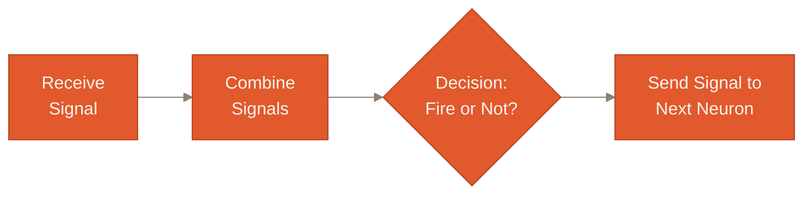

# Chapter 2

## Biology → Artificial Neuron

<div v-click class="thesis" style="margin-top:0.8em">ANN is <b>inspired by</b> biology. It is not a simulation of it.</div>

<!--
State the thesis line and then immediately relieve any anxiety about this
being a biology detour: "We are not doing neuroscience today. We're
borrowing exactly one idea from the brain, as fast as possible, and then
spending the rest of the chapter turning it into mathematics."

Transition: "Let's ask the obvious question first — why look at the brain
at all?"
-->

---
chapter: '2 · Biology → Artificial Neuron'
clicks: 3
---

# Why the human brain — and what one neuron does

<span class="eyebrow why">Why</span>

<div v-click class="key-message">Researchers looked at the most capable learning system they had access to.</div>

<blockquote v-click class="lecture-quote">
"You might be wondering why we're discussing biology in an Artificial Intelligence course. The answer is simple: researchers were inspired by one remarkable property of the human brain — its ability to learn from experience. They asked a simple question: <em>can we build a mathematical model that learns in a similar way?</em> That question led to the development of Artificial Neural Networks."
</blockquote>

<div v-click class="statement-box">ANN is inspired by biology; it is <b>not</b> a biological simulation.</div>

<div v-click>

<div class="key-message" style="margin-top:0.7em"><span class="eyebrow biology" style="margin-bottom:0">Biology</span> &nbsp;Four steps, repeated by every neuron in your brain, right now.</div>



</div>

<div v-click class="transition-line">This simple behaviour — not the biochemistry behind it — is what inspired the artificial neuron.</div>

<style>
.lecture-quote {
  border-left: 3px solid var(--ann-line);
  padding-left: 0.9em; margin: 0.9em 0;
  color: var(--ann-ink-soft); font-style: italic; font-size: 0.95rem;
}
.statement-box {
  background: var(--ann-indigo-soft); color: var(--ann-indigo);
  border-radius: 0.5em; padding: 0.55em 1em;
  font-family: 'Space Grotesk', sans-serif; font-weight: 600;
  display: inline-block;
}
/* this slide carries a quote, a statement, a diagram AND a transition line */
.slidev-layout .lecture-quote { margin: 0.6em 0; }
.slidev-layout .transition-line { margin-top: 0.7em; padding-top: 0.5em; }
</style>

<!--
[Merged from two slides: "Why the human brain?" + "How a biological neuron
works".]

Read the blockquote to the class essentially verbatim — it's written to be
spoken. Land on "can we build a mathematical model that learns in a similar
way?" as the actual research question that started this entire field.

Click 1 (statement box): be emphatic — "This sentence is the single most
important disclaimer in this chapter. Everything that follows is a loose
engineering analogy, not neuroscience." Likely question: "So is any of this
biologically accurate?" Only at the coarsest level — 'receive, combine,
decide, forward' is genuinely how neurons behave; everything past that has
no biological counterpart. Biomimicry, like a plane wing inspired by a bird
wing — not a feather-by-feather copy.

Click 2 (four-step diagram): narrate the boxes as a story, not a diagram —
"A neuron sits there, receiving small nudges from thousands of neighbours.
It doesn't react to any single nudge. It waits, combines everything, and
only then decides: fire, or stay silent. If it fires, that signal becomes
an input to the next neuron, and the process repeats one level down the
chain."

Click 3 (transition line): emphasize "not the biochemistry" — we're about
to throw away everything below this level of description and keep only the
four verbs: receive, combine, decide, send.

Transition: "Let's put a picture to this, one piece at a time — the same
way you'd examine it under a microscope, one structure at a time."
-->

---
chapter: '2 · Biology → Artificial Neuron'
clicks: 5
---

# Anatomy of one decision

<span class="eyebrow biology">Biology</span>

<NeuronDiagram />

<!--
This slide is almost all image — let the diagram carry the room and narrate
over it. This component reveals in exactly five clicks (it must have
`clicks: 5` set in frontmatter, since Slidev can't auto-detect clicks that
live inside a child component's own template):

Click 1 (slide load): just the bare outline appears — dendrites on the
left, a cell body in the middle, an axon with terminal branches on the
right. Say: "Here's the whole shape. Let's name the parts."

Click 2: dendrites highlight. "These are dendrites — the tree-like branches
that physically receive signals from thousands of neighbouring neurons."

Click 3: the soma (cell body) highlights. "This is the soma, the cell body.
This is where all of those incoming signals get physically combined into
one, and where the neuron checks whether that combined signal is strong
enough to act on."

Click 4: the axon highlights. "This is the axon — if the neuron decided to
fire, this is the cable that carries the output signal away, branching out
at the end to hand it to the next set of neurons."

Click 5: the teal dashed overlay appears. "And here is the entire reason we
just did that: every one of those biological parts has a mathematical
counterpart. Inputs, a weighted sum, an output. That overlay is the
artificial neuron, sitting on top of the same shape."

Likely student question: "Why does the diagram only show 3-4 dendrites when
real neurons have thousands?" Answer: "Purely for legibility — the biology
has thousands of inputs; our artificial neuron will typically have far
fewer, but the mathematics doesn't care about the count, it generalizes to
any number of inputs."

Transition: "Let's now go through those four biological structures one at a
time, and build their mathematical counterpart properly."
-->

---
chapter: '2 · Biology → Artificial Neuron'
clicks: 2
---

# The neuron, end to end

<span class="eyebrow structure">Structure</span>

<div class="key-message">Every piece from the last few minutes, connected into one pipeline.</div>

<div class="neuron-pipeline">
  <div class="np-inputs">x₁<br/>x₂<br/>x₃</div>
  <div class="np-arrow">→</div>
  <div class="np-node">
    <div class="np-bio">Dendrites</div>
    <div class="np-ann">Inputs</div>
  </div>
  <div class="np-arrow">→</div>
  <div class="np-node wide">
    <div class="np-bio">Soma</div>
    <div class="np-ann">Weighted Sum</div>
    <div class="np-eq"><span v-click>z = wᵀx + b</span></div>
  </div>
  <div class="np-arrow">→</div>
  <div class="np-node">
    <div class="np-bio">Threshold</div>
    <div class="np-ann">Activation Function</div>
  </div>
  <div class="np-arrow">→</div>
  <div class="np-node">
    <div class="np-bio">Axon</div>
    <div class="np-ann">Output</div>
  </div>
</div>

<div v-click class="transition-line">Chain enough of these together and you get <b>Input Layer → Hidden Layer → Output Layer</b> — properly built in Chapter 4.</div>

<style>
.neuron-pipeline { display: flex; align-items: center; gap: 0.5em; margin-top: 1.1em; }
.np-inputs {
  flex-shrink: 0; font-family: 'JetBrains Mono', monospace; font-size: 0.72rem;
  color: var(--ann-ink-soft); text-align: right; line-height: 1.5;
}
.np-arrow { color: var(--ann-muted); font-size: 1.3rem; flex-shrink: 0; }
.np-node {
  background: var(--ann-circuit-soft); border-left: 4px solid var(--ann-circuit);
  border-radius: 0.6em; padding: 0.7em 0.9em; text-align: center; flex: 1;
}
.np-node.wide { flex: 1.3; }
.np-bio {
  font-family: 'JetBrains Mono', monospace; font-size: 0.65rem; letter-spacing: 0.05em;
  text-transform: uppercase; color: var(--ann-ember); margin-bottom: 0.3em;
}
.np-ann { font-family: 'Space Grotesk', sans-serif; font-weight: 600; color: var(--ann-ink); font-size: 0.92rem; }
.np-eq { font-family: 'JetBrains Mono', monospace; font-size: 0.82rem; color: var(--ann-circuit); margin-top: 0.35em; min-height: 1.2em; }
</style>

<!--
This slide replaces what used to be four separate step-by-step slides — the
graph is the whole payoff, so narrate continuously across it rather than
pausing between parts. Trace it left to right, in one breath, then double
back for depth on request.

Receive (Dendrites → Inputs): ground this in an example the class can hold
onto: predicting graduate admission from CGPA, GRE score, interview score,
and number of research papers — x₁ through x₄, literally the inputs. Some
signals encourage firing, some discourage it, and the neuron doesn't react
to any single one individually — it first collects all of them. Likely
question: "Are inputs always numeric, even for an image or a word?" Yes —
by the time it reaches a neuron it's already a number; images and words are
converted upstream (a topic for later).

Combine (Soma → Weighted Sum): before adding inputs up, each needs an
importance value. Analogy: a hiring committee where everyone's opinion is
heard, but the senior interviewer's counts for more — you add up *weighted*
opinions, not raw ones. Tie back to admissions: does a committee weigh
CGPA, GRE, interview, and papers equally? Almost certainly not.

Click 1 reveals the equation. Read it as a sentence, not symbols: "z equals
input one times its weight, plus input two times its weight, plus input
three times its weight, plus a bias term" — z = wᵀx + b in compact form.
Name every symbol out loud: x = the inputs (the raw evidence), w = the
weights (how important each input is), b = the bias (a baseline offset,
full story next chapter), z = the weighted sum, one number combining
everything. In plain English: z is how strongly, overall, this evidence
pushes the neuron to fire. Likely question: "Is z the neuron's output?"
Not yet — z is only the combined evidence; whether the neuron fires because
of z is the next node's job.

Decide (Threshold → Activation Function): not every combined signal is
worth acting on. Biologically, the neuron only fires past a threshold — an
all-or-nothing event; artificial neurons generalize this into an activation
function that can be graded. Keep the menu of actual functions (sigmoid,
tanh, ReLU) deferred to next chapter — today, just that the decision step
exists. Foreshadow: skip this step entirely and stacking neurons is just
one linear calculation — the full reason why is next chapter's opening
topic.

Pass (Axon → Output): once fired, the axon carries the signal onward, and
the next neuron repeats the same pipeline on it — no new mechanism
required. Click 2 reveals the layer-chain line: don't build the full
architecture picture yet, just plant the vocabulary (input/hidden/output
layer). Likely question: "Is one neuron's output always exactly one number
to exactly one other neuron?" One number, typically broadcast to *many*
neurons in the next layer, each applying its own weight — Chapter 4 draws
this out fully.

Transition: "Before we formalize the network — let's justify why one
neuron is never enough on its own."
-->

---
chapter: '2 · Biology → Artificial Neuron'
clicks: 4
---

# Why does it take so many neurons — and layers?

<span class="eyebrow why">Why</span>

<div v-click class="key-message">Can one neuron recognize a face?</div>

<div v-click class="qa-answer">Almost certainly not — each neuron learns a small part; thousands, working together, solve the whole thing.</div>

<div v-click>

<div class="key-message" style="margin-top:0.6em">Different <b>layers</b> learn increasingly meaningful representations of the same input.</div>


</div>

<div v-click>

<Callout>
  <template #misconception>Engineers manually program each layer — "layer 2, detect edges; layer 5, detect eyes."</template>
  <template #clarification>Nobody programs "find an eye." The network <b>discovers</b> these representations on its own, because they reduce prediction error.</template>
</Callout>

</div>

<style>
.qa-answer {
  background: var(--ann-paper-raised); border-left: 4px solid var(--ann-indigo);
  padding: 0.7em 1em; border-radius: 0.4em; font-size: 0.95rem;
}
</style>

<!--
[Merged from two slides: "Why does it take so many neurons?" + "Why hidden
layers? Representation Learning".]

Click 1 (title question): ask it and wait for guesses — it lands better as
a real question than a rhetorical one.

Click 2 (answer): be concrete — a single neuron computes one weighted sum
and one decision — geometrically, one decision boundary. Recognizing a face
requires combining an enormous number of such boundaries.

Click 3 (representation-learning beat): walk the pixel-to-identity chain as
increasing abstraction — edges, then corners, then shapes, then parts, then
identity. Define "Representation Learning" precisely: automatically
learning a useful transformation of raw data into increasingly abstract
features, as a side-effect of minimizing prediction error.

Click 4 (misconception callout): read both halves slowly — one of the most
common false beliefs students carry in from pop-science AI coverage.

Likely student question: "Then how does the network 'know' to learn edges
first?" Defer gracefully: "That emerges from training — exactly what the
next slide, and all of Chapter 4, explains."

Transition: "If nobody tells it what an eye is — who teaches it anything at
all?"
-->

<!-- ---
chapter: '2 · Biology → Artificial Neuron'
clicks: 1
---

# Who teaches the network what an eye is?

<span class="eyebrow why">Why</span>

<div class="key-message">Nobody. It only ever sees an input and the correct label.</div>

```text
Image  →  "Cat"
Image  →  "Dog"
```

<div v-click>

<div class="learn-steps">
  <div>1. The network guesses — usually wrong at first.</div>
  <div>2. The size of the error is measured.</div>
  <div>3. Every weight is nudged to make that error a little smaller.</div>
  <div>4. Repeat, across millions of images.</div>
</div>

<div class="transition-line">Some neurons end up sensitive to edges, others to corners, others to shapes — <b>because</b> that sensitivity happens to reduce error. Nobody assigned them that job.</div>

</div>

<style>
.learn-steps { display: flex; flex-direction: column; gap: 0.35em; margin: 0.8em 0; font-size: 0.95rem; }
.learn-steps div { padding-left: 0.6em; border-left: 2px solid var(--ann-circuit); }
</style> -->

<!--
This slide is the direct answer to the question students are quietly asking
throughout the whole "representation learning" discussion. Say it plainly:
"The network is given exactly two things — an input, and the correct
answer. That's it. No hints about eyes, edges, or fur texture."

Walk the four-step learning loop at a high level — deliberately don't name
"forward propagation," "loss function," or "backpropagation" as formal terms
yet; that formal vocabulary is the entirety of Chapter 4. Today, keep it in
plain English: guess, measure the miss, nudge the weights, repeat.

Emphasize the causal "because": neurons don't become edge-detectors by
assignment, they become edge-detectors because doing so happens to reduce
the measured error, given the data and the architecture. This is subtle and
worth restating twice.

Likely student question: "Couldn't neurons just as easily learn something
useless?" Answer: "In principle, yes, and this is an active area of
interpretability research — but empirically, on tasks like image
recognition, the useful, human-recognizable features (edges, textures,
parts) reliably tend to emerge, likely because they are genuinely efficient
building blocks for many visual tasks at once."

Transition: "We now have every piece of the biological analogy. Let's put
the whole map side-by-side, once, properly."
-->

---
chapter: '2 · Biology → Artificial Neuron'
clicks: 6
---

# The complete map

<span class="eyebrow structure">Structure</span>

<table>
  <thead>
    <tr>
      <th>Biological neuron</th>
      <th>Artificial neuron</th>
      <th>Purpose</th>
    </tr>
  </thead>
  <tbody>
    <tr v-click>
      <td><span class="map-bio">Dendrites</span></td>
      <td>Inputs <span class="map-eq">(x)</span></td>
      <td>Receive information</td>
    </tr>
    <tr v-click>
      <td><span class="map-bio">Synapse</span></td>
      <td>Weights <span class="map-eq">(w)</span></td>
      <td>Represent importance of each input</td>
    </tr>
    <tr v-click>
      <td><span class="map-bio">Soma</span></td>
      <td>Weighted Sum <span class="map-eq">(wᵀx+b)</span></td>
      <td>Combine information</td>
    </tr>
    <tr v-click>
      <td><span class="map-bio">Threshold</span></td>
      <td>Activation Function</td>
      <td>Decide whether / how strongly to activate</td>
    </tr>
    <tr v-click>
      <td><span class="map-bio">Axon</span></td>
      <td>Output</td>
      <td>Send information to the next neuron</td>
    </tr>
    <tr v-click>
      <td><span class="map-bio">Network of Neurons</span></td>
      <td>Layers in ANN</td>
      <td>Learn increasingly complex representations</td>
    </tr>
  </tbody>
</table>

<style>
.map-bio { color: var(--ann-ember); font-weight: 600; }
.map-eq { font-family: 'JetBrains Mono', monospace; color: var(--ann-circuit); }
</style>

<!--
This is a recap, not new information — the table now builds one row per
click (header on screen from the start). Go briskly (roughly 5-8 seconds
per row), reading the biological term, its artificial counterpart, and the
one-phrase purpose, clicking to reveal each as you name it.

Click 1 (Dendrites → Inputs), Click 2 (Synapse → Weights), Click 3 (Soma →
Weighted Sum), Click 4 (Threshold → Activation Function), Click 5 (Axon →
Output) — these five are pure recap of the single-neuron pipeline from the
last few slides, no new content.

Click 6 (Network of Neurons → Layers in ANN): land on the fact that this
final row is new relative to the earlier per-neuron rows — it's the bridge
from "one neuron" to "an architecture," which is exactly where Chapter 4
will pick up.

If a student asks "is this the complete list of biological structures?" —
answer honestly: "No — real neurons have far more structure (myelin sheaths,
neurotransmitter types, glial cells...) that has no counterpart here at all.
This table only keeps the pieces relevant to the engineering analogy."

Transition: hold on this slide a beat, then move directly into the closing
statement on the next slide.
-->

---
layout: quote
chapter: '2 · Biology → Artificial Neuron'
---

# "We didn't copy the human brain in detail. We borrowed one simple principle: <span style="color:var(--ann-circuit)">receive information, combine it, make a decision, and pass it forward.</span>"

<div class="transition-line" style="margin-top:1em; text-align:center;">An artificial neuron follows exactly that pipeline — with numbers instead of electricity. Connect thousands of them, train them on data, and they can recognize faces, understand speech, and translate languages.</div>

<!--
Deliver this slide slowly and mostly from memory rather than reading it —
it's written to be the emotional and conceptual close of the chapter. Let
the pause after it breathe for a second or two before moving on.

This is also a good moment to explicitly signal the shift in altitude:
"Everything from here forward is going to look much more like ordinary
applied mathematics. We've earned that — the biology has done its job as
motivation, and it will not reappear as a teaching device for the rest of
the lecture, only as an occasional reminder of where a term came from."

Transition: "Let's go build out the full mathematical shape of one neuron —
starting with a term we glossed over: the bias."
-->
