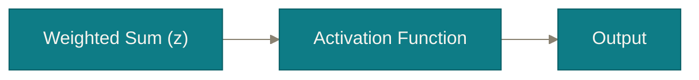

# Chapter 3

## The Full Neuron

One more ingredient, one more decision — and the artificial neuron is complete.

<!--
Quick orientation: "We left the biology chapter with z = wᵀx + b and a
promise to explain b properly, plus a promise to explain the decision step
(activation) properly. That's this whole chapter — two promises kept, then
one reassurance that ties it back to what you already know."

Transition: "Let's start with the term we glossed over — bias."
-->
<!-- 
---
chapter: '3 · The Full Neuron'
clicks: 1
---

# Why bias?

Math

Bias shifts the decision boundary — it's a baseline, not an error term.

Even an all-zero input might deserve a nonzero baseline chance. Bias encodes that baseline, independent of any input.

<svg viewBox="0 0 220 100" class="bias-svg" xmlns="http://www.w3.org/2000/svg">
  <line x1="10" y1="90" x2="210" y2="90" stroke="var(--ann-line)" stroke-width="1" />
  <path d="M15,88 C67,88 93,12 145,12" fill="none" stroke="var(--ann-circuit)" stroke-width="3" />
  <path d="M45,88 C97,88 123,12 175,12" fill="none" stroke="var(--ann-ember)" stroke-width="3" stroke-dasharray="6 4" />
  <text x="15" y="98" class="bias-label" fill="var(--ann-circuit)">b = 0</text>
  <text x="150" y="98" class="bias-label" fill="var(--ann-ember)">b &gt; 0</text>
</svg>

Same neuron, same weights — only <i>b</i> differs. The curve slides; it doesn't change shape.

<Callout>
  <template #misconception>Bias is a fudge factor / error term used to patch up the model's mistakes.</template>
  <template #clarification>Bias is a learned parameter like any weight. It shifts <i>where</i> the decision boundary sits — it never measures error.</template>
</Callout>

 -->

<!--
Open with the motivating question: "z = wᵀx is always exactly zero when
every input is zero. Is a zero baseline always the right assumption?" Use a
concrete case: a spam filter where the email has zero of every suspicious
keyword — should its baseline spam probability be exactly 0, or some small
nonzero prior? Bias lets the model encode that baseline.

Click to reveal the two-curve figure, and read it as: "This teal curve and
this dashed ember curve are the same neuron, same weights — the only
difference is a different bias term. Notice the shape is identical; the
whole curve has simply slid sideways." This foreshadows the sigmoid shape
you're about to formally introduce, without naming it yet.

State plainly, because it's a genuinely common point of confusion: "Bias is
not the model's error, and it is not the loss. It's a learned parameter,
exactly like a weight, except it doesn't multiply any input — it's added
unconditionally." The misconception callout next to the figure exists
because students often confuse bias with an error/fudge-factor term —
read both halves of it aloud once the figure is up.

Likely student question: "Is bias learned during training, the same way
weights are?" Answer: "Yes — identically. It's just one more number
adjusted by backpropagation, which we cover in Chapter 4."

Transition: "z = wᵀx + b now fully makes sense. But we still owe you a real
answer for what happens to z next."
-->

---
chapter: '3 · The Full Neuron'
clicks: 3
---

# Why activation functions must exist

Math

Without Activation Function, stacking layers buys you <i>nothing new</i>.

A linear function of a linear function is still just linear: stack ten layers of plain weighted sums with nothing in between, and the result is mathematically identical to <i>one</i> weighted sum with different numbers. Depth would buy you <b>nothing.</b>

The activation function is what introduces <b>nonlinearity</b> — the ability to bend, not just scale and shift.

<!--
This is the one place today's format allows a touch more derivation than
usual, because the intuition genuinely rests on it — but keep it to one
sentence, no algebra on-screen. Say the argument out loud: "If every layer
just computes a weighted sum of the previous layer's weighted sum, you can
always multiply those two sets of weights together algebraically and get
one equivalent single-layer weighted sum. So without something non-linear
in between, a 100-layer network is secretly no more powerful than a
single neuron."

Land the payoff term clearly: nonlinearity. Ask: "So what does the
activation function need to be, at minimum?" Answer: "Anything that is not
just a scaled, shifted straight line."

Likely student question: "Does the activation function need to be
complicated to work?" Answer: "No — you'll see in a moment that one of the
most successful choices (ReLU) is almost embarrassingly simple: a single
bend at zero. Simple non-linearity is still non-linearity."

Transition: "Let's meet the three activation functions you'll encounter
constantly in practice."
-->

---
chapter: '3 · The Full Neuron'
clicks: 3
---

# Three activation functions you'll meet constantly

In practice

<svg viewBox="0 0 160 100" xmlns="http://www.w3.org/2000/svg">
  <line x1="10" y1="90" x2="150" y2="90" stroke="var(--ann-line)" stroke-width="1" />
  <line x1="80" y1="10" x2="80" y2="90" stroke="var(--ann-line)" stroke-width="1" />
  <path d="M15,88 C67,88 93,12 145,12" fill="none" stroke="var(--ann-circuit)" stroke-width="3" />
</svg>

**Sigmoid** &nbsp;$\sigma(z)=\dfrac{1}{1+e^{-z}}$

Range: 0 to 1 · Used for probabilities

<svg viewBox="0 0 160 100" xmlns="http://www.w3.org/2000/svg">
  <line x1="10" y1="50" x2="150" y2="50" stroke="var(--ann-line)" stroke-width="1" />
  <line x1="80" y1="10" x2="80" y2="90" stroke="var(--ann-line)" stroke-width="1" />
  <path d="M15,90 C67,90 93,10 145,10" fill="none" stroke="var(--ann-circuit)" stroke-width="3" />
</svg>

**Tanh**

Range: −1 to 1 · Zero-centered

<svg viewBox="0 0 160 100" xmlns="http://www.w3.org/2000/svg">
  <line x1="10" y1="70" x2="150" y2="70" stroke="var(--ann-line)" stroke-width="1" />
  <line x1="80" y1="10" x2="80" y2="90" stroke="var(--ann-line)" stroke-width="1" />
  <path d="M15,70 L80,70 L145,12" fill="none" stroke="var(--ann-circuit)" stroke-width="3" />
</svg>

**ReLU** &nbsp;$f(x)=\max(0,x)$

Simple · fast · most used today

<!--
Reveal one card per click and spend roughly 40-60 seconds on each:

Sigmoid: squashes any real number into (0, 1) — perfect when the output
needs to be read as a probability. Downside to mention briefly (without
over-deriving): for very large positive or negative z, the curve is almost
flat, so it "saturates" and gradients shrink — this previews why ReLU
became more popular, without doing the calculus here.

Tanh: same S-shape, but centered on zero and ranging -1 to 1. Useful when
you want outputs that can be genuinely negative, and empirically often
trains a little better than sigmoid because its output is zero-centered.

ReLU: by far the most common choice in modern hidden layers. It's
piecewise-linear: zero for any negative input, identity for any positive
input. Emphasize why it's popular: trivially cheap to compute, and it does
not saturate for positive inputs the way sigmoid/tanh do.

Likely student question: "If ReLU is just two straight lines, is it really
'nonlinear'?" Answer: "Yes — the bend at zero is exactly the kind of
non-linearity the previous slide required. It doesn't need to be curvy to
be nonlinear, it just can't be a single straight line everywhere."

Another likely question: "Which one should I use?" A fair, honest answer:
"As a default for hidden layers today, ReLU (or a variant of it). Sigmoid
is typically reserved for a final output layer when you specifically want a
probability."

Transition: "We now have a complete neuron: weighted sum, bias, activation.
Here's a reassuring fact about what you just built."
-->

---
chapter: '3 · The Full Neuron'
---

# You've already met this neuron

In practice

One neuron, with a sigmoid activation, <i>is</i> Logistic Regression.

$$z = w^Tx + b \qquad\qquad \hat{y} = \sigma(z)$$

The only real difference: ANN doesn't stop at one neuron — it <b>connects many of them into layers.</b> That's Chapter 4.

<!--
This slide exists purely to lower anxiety and build confidence — make that
explicit: "If everything today felt brand new, here's the reassurance:
you've been computing something extremely close to this since your first
Machine Learning course."

Walk the equivalence directly: Logistic Regression computes exactly
z = wᵀx + b, then applies the sigmoid to squash it into a probability.
That is, structurally, one artificial neuron with a sigmoid activation.
Nothing about today's neuron is more exotic than a model they already know
how to train.

Likely student question: "So is Deep Learning just repeated Logistic
Regression?" Give a fair, careful answer: "In a loose structural sense, one
neuron is that simple — but stacking many of them, in layers, with
non-linear activations in between, produces something qualitatively more
expressive than any single logistic regression could ever be. That jump —
from one neuron to a network of them — is exactly next chapter."

Transition: "Let's connect many of these neurons together, and watch how
the resulting network actually learns."
-->
