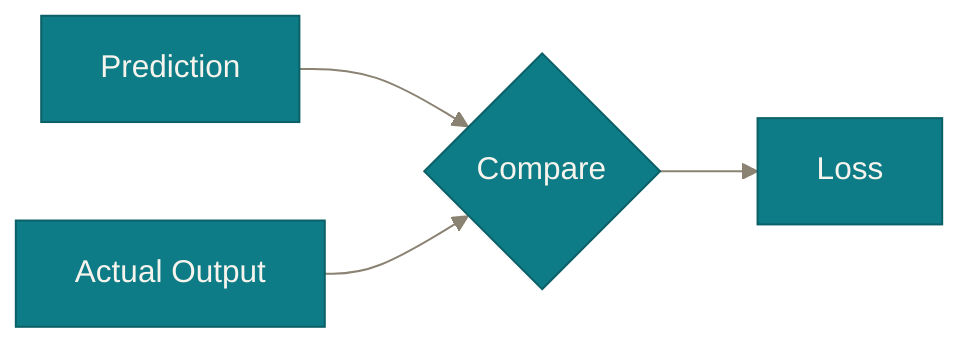
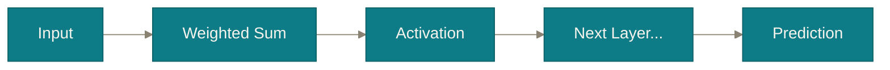
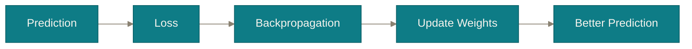
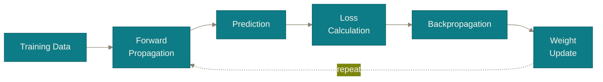

# Chapter 4

## How the Network Learns

Prediction and learning are <b>two different processes.</b> One of them doesn't learn anything at all.

<!--
Orientation: "We now have a complete single neuron. This chapter is about
what happens when you wire many of them together and actually train the
result. Four ideas, in a strict order: architecture, prediction,
measuring wrongness, and fixing it."

Transition: "Let's formalize the picture we've been building piece by
piece — the full network."
-->

---
chapter: '4 · How the Network Learns'
---

# ANN Architecture

Structure

Every neuron repeats the exact same four steps — receive, sum, activate, pass.

Source: <a href="https://commons.wikimedia.org/wiki/File:Colored_neural_network.svg" target="_blank">Wikimedia Commons</a>, by Glosser.ca — CC BY-SA 3.0

Real networks often stack <b>several</b> hidden layers — this is the same single-neuron idea from Chapter 3, just repeated and wired together.

<!--
This slide is a formalization, not new content — say so explicitly: "There
is nothing here you haven't already met. Every one of those dots is exactly
the neuron we built last chapter: it receives inputs, computes a weighted
sum, applies an activation function, and passes its output on."

[Image swapped from the custom Mermaid diagram to a real Wikimedia Commons
illustration ("Colored neural network.svg" by Glosser.ca, CC BY-SA 3.0) at
the user's request. Its red/blue/green input/hidden/output coloring is the
source image's own — deliberately left as-is rather than reskinned, since
the point of using a real external diagram is that it reads as an authentic
citable reference, not a custom-branded one. Attribution is required by the
license and shown directly under the image.]

Point out the layer names as you trace the diagram left to right: input
layer (just holds the raw features, doesn't compute anything itself),
hidden layer(s) (where the receive→sum→activate→pass cycle actually
happens), output layer (produces the final prediction — its activation is
chosen based on the task, e.g. sigmoid for yes/no classification).

Likely student question: "Why are they called 'hidden' layers?" Answer:
"Purely because their outputs aren't directly observed as the final answer —
'hidden' from the outside, not secret or mysterious. You, the model
builder, can absolutely inspect them."

Transition: "With this structure in place, let's watch it actually produce
a prediction."
-->

---
chapter: '4 · How the Network Learns'
---

# The Loss Function: measuring "how wrong"

Math

A single number that says how far a prediction was from the truth.

  
<b>Large loss</b> → poor prediction

  
<b>Small loss</b> → good prediction

But where does "Prediction" actually come from? Let's watch a network produce one — and immediately use this exact loss to correct itself.

<!--
Introduce the loss function as the answer to "how do we know if a
prediction is good?" — it's simply a formula that compares the prediction
to the known correct answer (available during training, since these are
labeled examples) and outputs one number capturing the size of the miss.

You don't need to name specific loss formulas (MSE, cross-entropy) today —
keep it conceptual: big gap between prediction and truth → big loss value;
near-perfect prediction → loss close to zero. The exact formula is a detail
for a later, more technical lecture.

Likely student question: "Is loss the same thing as accuracy?" Answer: "No
— accuracy is a human-facing summary like '92% correct.' Loss is a
finer-grained, differentiable number used internally, during training, to
tell the network exactly which direction to adjust its weights."

Click to reveal the transition line — we've deliberately defined loss
*before* showing where a prediction comes from, so hold that question open:
"Where does 'Prediction' come from?" Transition: "Let's watch a network
produce one — and immediately use this exact loss to correct itself."
-->

---
chapter: '4 · How the Network Learns'
clicks: 3
---

# Forward Propagation → Backpropagation

In practice

Information flows forward to a prediction — then the error flows backward to correct it.

Run this on an <b>untrained</b> network and you'll get a prediction anyway — almost certainly a <b>bad</b> one. No learning has happened yet.

Math

<Callout>
  <template #misconception>The network "notices" its mistake and consciously corrects itself.</template>
  <template #clarification>It's calculus, not awareness. Backpropagation computes exactly how much <i>each</i> weight contributed to the loss, and nudges it slightly in the direction that reduces it.</template>
</Callout>

<!--
[Merged from two slides: "Forward propagation: making a prediction" +
"Backpropagation: turning error into improvement". Loss was defined on the
previous slide, deliberately before this one, so both propagation
directions can be taught back-to-back as a single mental unit.]

Forward half (diagram shown immediately): trace it — an input goes in, gets
weighted and summed, passed through an activation, handed to the next
layer, until a prediction pops out. Click 1 reveals the key point: forward
propagation runs with whatever weights the network currently has — even
freshly initialized random ones — and will confidently output *something*,
likely garbage before training. Likely question: "Is forward propagation
the same as 'using' a trained model?" Yes — inference is just forward
propagation with already-trained weights.

Click 2 (backprop diagram): now pick up the loss from the previous slide —
"the error doesn't just vanish. It gets sent backward through the network,
layer by layer, and at every weight we ask: if I nudge this slightly, does
the loss go up or down, and by how much? That question, answered for every
weight, is backpropagation." No need to derive the chain rule on-screen —
that's a dedicated math lecture.

Click 3 (misconception callout): read it with real emphasis — probably the
most anthropomorphized idea in deep learning. No weight "knows" it made a
mistake; it's adjusted purely because a derivative computed its share of
the blame. Likely question: "One weight at a time?" No — conceptually all
weights update together, once per pass, via the chain rule.

Transition: "One backward pass nudges every weight a tiny bit. How many
times do we have to repeat that?"
-->

---
chapter: '4 · How the Network Learns'
---

# The training loop

In practice

Repeat forward → loss → backward → update, thousands of times.

Training stops once the loss becomes <b>sufficiently small</b> — at that point, the weights represent genuinely useful relationships in the data.

<!--
Zoom out and name the full cycle: this is one "epoch" or, more precisely,
one iteration of training — forward propagation produces a prediction, the
loss function scores it, backpropagation assigns blame, weights update by a
tiny amount, and the entire cycle repeats on the next batch of examples.

Emphasize the word "thousands," or in modern practice, often millions:
this is not a five-step process that finishes quickly — it's a loop that
runs an enormous number of times, each time nudging the weights a tiny bit
closer to something useful.

Likely student question: "How do we know when to stop?" Answer, kept
simple: "When the loss stops meaningfully improving, or reaches a threshold
you've decided is good enough. There's a whole subfield around exactly
this decision (overfitting, validation sets) — out of scope for today, but
good to know it exists."

Transition, into the next chapter: "So after all of that — after millions
of tiny weight nudges — does the network actually *understand* the images
it's classifying? Let's confront that question directly."
-->
