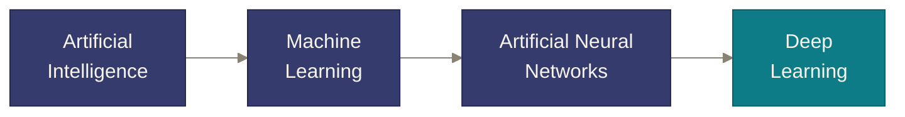
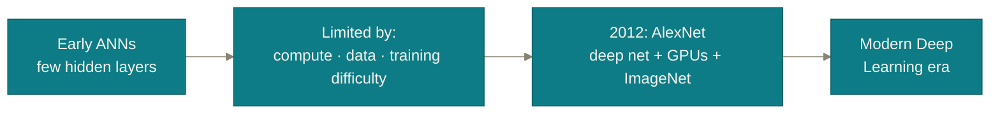

# Chapter 5

## Deep Learning & Synthesis

<div class="thesis" style="margin-top:0.8em">Neurons don't understand anything. Stacked, trained, and scaled — they don't need to.</div>

<!--
Orientation: "Last chapter we watched a network learn. Now let's confront
an honest, slightly uncomfortable question about what that learning
actually amounts to — and then zoom out to where this all leads: Deep
Learning."

Transition: "Let's start with the honest question."
-->

---
chapter: '5 · Deep Learning & Synthesis'
clicks: 1
---

# Does an ANN "understand" images?

<span class="eyebrow why">Why</span>

<div class="key-message">No. It starts as, and always remains, arithmetic on numbers.</div>

```text
125  130  121
255  240  210
 ...  ...  ...
```

<div class="transition-line">That grid of numbers is the <b>entire</b> input. No pixels are labeled "fur" or "eye."</div>

<div v-click>

<Callout>
  <template #misconception>After training, the network "understands" the image roughly the way a human does.</template>
  <template #clarification>It never understands in any human sense. Training makes certain hidden neurons statistically <b>sensitive</b> to patterns that happen to correlate with the correct label — that's optimization, not comprehension.</template>
</Callout>

</div>

<!--
Show the grid of numbers and let it sit for a second — this is genuinely
the entire input a network receives for an image; there is no hidden
channel carrying semantic meaning alongside it.

Walk the honest progression: early layers become sensitive to simple
contrast patterns (edges), later layers combine those into increasingly
task-relevant patterns, purely because doing so reduced the loss during
training on millions of examples. At no point does anything resembling
human understanding, awareness, or meaning enter the system.

Click to reveal the misconception callout — this is worth lingering on,
because it's the single most common piece of hype students will have
absorbed from popular media before this course. Be matter-of-fact, not
dismissive: the results can be extremely impressive and useful without
requiring understanding in the human sense.

Likely student question: "Then why do the visualized filters in a CNN look
like edge detectors, eyes, or textures — doesn't that mean it 'gets' visual
concepts?" Answer: "It means those features happen to be statistically
useful for the task, which is exactly what we'd predict if the network
found genuinely efficient building blocks — not evidence of awareness or
symbolic understanding of what an 'eye' is."

Transition: "With that honesty in place, let's zoom out and place ANN in
the bigger picture you keep hearing about: Deep Learning."
-->

---
chapter: '5 · Deep Learning & Synthesis'
clicks: 1
---

# What is Deep Learning, really?

<span class="eyebrow structure">Structure</span>

<div class="key-message">Deep Learning is simply an ANN with many hidden layers.</div>



<div v-click>

<div class="key-message">Every Deep Learning model is an ANN. Not every ANN is Deep Learning.</div>

<div class="task-grid" style="margin-top:0.5em">
  <div class="task-chip">CNN</div>
  <div class="task-chip">RNN</div>
  <div class="task-chip">LSTM</div>
  <div class="task-chip">Transformers</div>
</div>

</div>

<!--
Draw the hierarchy and read it top-down: "AI is the broadest goal — building
systems that behave intelligently. Machine Learning is one strategy for
that — learning from data instead of hand-coded rules. Artificial Neural
Networks are one family of ML models, the one we've spent this entire
lecture on. Deep Learning is simply the name for ANNs that have many
hidden layers stacked."

Click to reveal the precise logical relationship and the concrete examples:
CNNs (convolutional networks, common in vision), RNNs and LSTMs (historically
common for sequences), and Transformers (the architecture behind most
modern large language models) — all of these are, structurally, deep
neural networks. None of them require any new theory beyond what's been
built today: neurons, weighted sums, activations, layers, backpropagation.

Likely student question: "So a 2-hidden-layer network from the 1990s isn't
'Deep Learning'?" Answer: "Correct, by the common usage of the term — it's
an ANN, just not a *deep* one. The line is fuzzy and more about convention
than a strict threshold, but the core idea — 'deep' means 'many hidden
layers' — is the useful takeaway."

Transition: "If the theory hasn't fundamentally changed, why did Deep
Learning explode in popularity specifically around the last decade?"
-->

---
chapter: '5 · Deep Learning & Synthesis'
---

# Why Deep Learning succeeded when it did

<span class="eyebrow why">Why</span>

<div class="key-message">The theory was old. Compute, data, and one 2012 result made it practical.</div>



<div class="transition-line">Same neuron. Same backpropagation. <b>Enough</b> compute and data to finally make depth pay off.</div>

<!--
Give brief historical honesty: neural networks and backpropagation are not
new ideas — the mathematics existed for decades before Deep Learning became
the dominant approach. What changed was practical, not theoretical:
affordable GPUs made the enormous number of weighted-sum computations
feasible, and the internet produced the large labeled datasets deep
networks need to train well.

Name AlexNet (2012) as the concrete turning point: a deep convolutional
network, trained on GPUs, on the large ImageNet dataset, that dramatically
outperformed the previous best approaches on image classification. That
single dramatic result is widely credited with triggering the modern Deep
Learning boom.

Likely student question: "Was AlexNet using fundamentally new algorithms?"
Answer: "No — it used the same core ingredients this entire lecture has
covered: neurons, weighted sums, activations (ReLU specifically, which
this course just introduced), backpropagation. The novelty was combining
proven theory with newly-practical scale."

Transition: "Let's pull everything today back together into one coherent
picture."
-->

---
chapter: '5 · Deep Learning & Synthesis'
clicks: 5
---

# Putting it all back together

<span class="eyebrow structure">Structure</span>

<div class="recap-row">
  <div v-click="1" class="recap-chip">Rules broke down</div>
  <div class="recap-sep">→</div>
  <div v-click="2" class="recap-chip">Learn from data instead</div>
  <div class="recap-sep">→</div>
  <div v-click="3" class="recap-chip">Borrow the brain's pipeline</div>
  <div class="recap-sep">→</div>
  <div v-click="4" class="recap-chip">One neuron: <span class="mono">wᵀx+b</span> → activation</div>
  <div class="recap-sep">→</div>
  <div v-click="5" class="recap-chip">Train with backprop, stack deep</div>
</div>

<div v-click="5" class="key-message" style="margin-top:1em">Artificial Neural Networks learn complex, nonlinear relationships directly from data by automatically adjusting their weights during training — trading manual feature engineering for representation learning through layers.</div>

<style>
.recap-row { display: flex; flex-wrap: wrap; align-items: center; gap: 0.5em; margin-top: 1em; }
.recap-chip {
  background: var(--ann-paper-raised); border: 1px solid var(--ann-line);
  border-radius: 0.5em; padding: 0.5em 0.8em; font-size: 0.85rem;
  font-family: 'Space Grotesk', sans-serif;
}
.recap-sep { color: var(--ann-muted); }
.mono { font-family: 'JetBrains Mono', monospace; }
</style>

<!--
Click through the five recap chips in order, and for each, give a
one-breath callback rather than re-teaching it:

1. "Rules broke down" → hand-written IF-statements can't cover perceptual
   tasks with unbounded variation.
2. "Learn from data instead" → Machine Learning's core move; but classic ML
   still needed hand-designed features.
3. "Borrow the brain's pipeline" → receive, combine, decide, pass — inspired
   by, not copied from, biological neurons.
4. "One neuron" → the complete mathematical object: weighted sum plus bias,
   then a nonlinear activation.
5. "Train with backprop, stack deep" → forward propagation predicts,
   backpropagation corrects, and enough layers plus enough scale is what we
   now call Deep Learning.

Land on the final paragraph slowly — it's deliberately dense, because by
this point in the lecture every phrase in it should already make sense
without further explanation. If any single phrase doesn't land, that's a
useful diagnostic for which chapter to briefly revisit.

Transition: "One sentence, if you remember nothing else."
-->

---
layout: quote
chapter: '5 · Deep Learning & Synthesis'
---

<div class="eyebrow structure" style="justify-content:center">The one sentence</div>

# "Artificial Neural Networks are machine learning models <span style="color:var(--ann-ember)">inspired by biological neurons.</span> They learn complex, nonlinear relationships directly from data by <span style="color:var(--ann-circuit)">automatically adjusting their weights</span> during training — reducing the need for manual feature engineering, and enabling powerful <span style="color:var(--ann-indigo)">representation learning</span> through multiple hidden layers."

<style>
h1 { font-size: 1.7rem; line-height: 1.5; }
</style>

<!--
This is the single sentence the entire lecture has been building towards —
deliver it slowly, and consider pausing briefly after each colored phrase,
since each color corresponds to a full chapter of today's lecture:

Ember phrase ("inspired by biological neurons") → Chapter 2.
Teal phrase ("automatically adjusting their weights") → Chapter 4.
Indigo phrase ("representation learning") → Chapters 2 and 5.

Tell the class directly: "If you can explain this one sentence, and then
unpack any phrase in it on request, you have a genuinely solid Master's-level
introduction to Artificial Neural Networks — which was the entire goal of
today."

This is a natural point for questions before the closing slide.
-->

---
layout: end
chapter: ''
---

# Questions?

<div class="transition-line" style="text-align:center; margin-top:1em;">Next time: the actual mathematics of backpropagation, and our first framework.</div>

<!--
Open the floor. A few questions worth having pre-baked answers for, since
they come up almost every time this lecture is given:

"Why not just use one giant hidden layer instead of several smaller ones?"
→ Depth (many modest layers) tends to build increasingly abstract, reusable
representations far more efficiently than making a single layer extremely
wide — this is an empirical finding as much as a theoretical one, worth
flagging as "we'll see evidence of this later in the course."

"How do we choose the number of layers / neurons per layer?" → Mostly
empirical, guided by experimentation and known architectures for a given
task — a topic for a later, more practical lecture.

"Is backpropagation how the brain actually learns?" → Almost certainly not
in the literal sense — this is an active, unresolved research question in
computational neuroscience, and a good moment to reinforce today's core
disclaimer one final time: inspired by, not a simulation of.

Close by previewing next time explicitly, so the transition out of this
lecture is as deliberate as every transition within it.
-->
