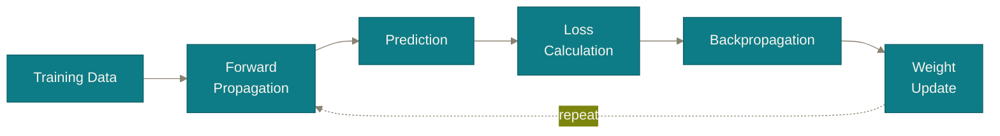

# Chapter 6

## From one step to training

One example gave you one gradient. Training needs a policy for <i>which</i> examples, and <i>how often</i>.

<!--
Short orientation: "Everything so far used exactly one training example. Real
datasets have millions. The last piece is simply a decision about when to
take the step — and it comes with four words you will meet in every training
script you ever read."

Transition: "Four words, one idea."
-->

---
chapter: '6 · From one step to training'
clicks: 5
---

# Epoch, batch, iteration, SGD

In practice

Four words that all answer one question — <i>when do we take the step?</i> Nothing else changes.

  
batchHow many examples you average the gradient over before stepping. Chapter 4 used a batch of <b>one</b>.

  
iterationOne step. One forward pass, one backward pass, one update — exactly what you did by hand.

  
epochOne complete pass through the whole training set. Usually <i>many</i> iterations, not one.

  
SGDStochastic gradient descent — estimate the gradient from a random subset instead of all the data.

<Callout>
  <template #misconception>SGD is a different algorithm from gradient descent.</template>
  <template #clarification>Identical update rule — <b>w ← w − η ∂E/∂w</b>, unchanged. The only difference is <i>which examples the gradient was estimated from</i>. "Stochastic" describes the sampling, not the mathematics of the step. Everything you did in Chapter 4 was one SGD step with a batch size of one.</template>
</Callout>

<!--
Go briskly — this is vocabulary, not new mechanism, and students mostly half
know it already. The value is in nailing the distinctions.

Click 3 (epoch) — CASH LECTURE 1'S SELF-FLAGGED IMPRECISION, and quote it
back at them, because it is satisfying: "Last lecture I said, and I'm
quoting my own speaker notes, 'this is one epoch or, more precisely, one
iteration of training.' I hedged because the distinction didn't matter yet.
It matters now. An epoch is a full pass over the data. An iteration is one
weight update. If you have 10,000 examples and a batch size of 100, one
epoch is 100 iterations."

Click 4 (SGD): why sample at all? Because computing the exact gradient over
millions of examples before taking a single step is absurdly slow. A noisy
estimate from 32 examples, taken now, beats a perfect one taken in an hour.
Worth adding: the noise is often *helpful* — it can knock you out of bad
regions of the landscape.

Click 5 (callout): read both halves.

RE-DEFER OVERFITTING EXPLICITLY, here, or it silently rots. Last lecture I
said "there's a whole subfield around exactly this decision — overfitting,
validation sets — out of scope for today." It is out of scope again today.
Say so, and say when: "I owe you that one twice over now. Driving the
training loss to zero is usually a symptom of memorisation, not learning,
and the machinery for detecting and preventing that is its own lecture. I am
deferring it deliberately, not forgetting it."

Transition: "Let's put the whole thing back together — and look at a slide
you have already seen."
-->

---
chapter: '6 · From one step to training'
clicks: 5
---

# The training loop — now you can read every box

Structure

The same diagram as last lecture. Every box now has an equation under it.

  
Forwarda⁽ˡ⁾ = σ( W⁽ˡ⁾a⁽ˡ⁻¹⁾ + b⁽ˡ⁾ )slides 17–18

  
LossE = ½ Σ ( o − t )²slide 18

  
Backpropδ⁽ᴸ⁾ = (a⁽ᴸ⁾−y) ⊙ σ′(z⁽ᴸ⁾) &nbsp;·&nbsp; δ⁽ˡ⁾ = ( (W⁽ˡ⁺¹⁾)ᵀ δ⁽ˡ⁺¹⁾ ) ⊙ σ′(z⁽ˡ⁾)slides 19–21

  
UpdateW ← W − η δ⁽ˡ⁾(a⁽ˡ⁻¹⁾)ᵀslide 22

Last lecture this diagram was four words you took on trust. Now it is four equations you have evaluated by hand.

<!--
This is quietly the most satisfying slide in the lecture, and it works
because of recognition, not novelty. Put the diagram up and say: "You have
seen this exact picture before. It was on a slide last lecture and it was
four words you had to take on trust."

Then reveal one equation per box, and for each, name the slide where they
computed it themselves. Do not re-teach any of them — the entire effect
depends on going fast and letting them notice they already know it.

Click 5: land the arc. A diagram that was a promise has become a
specification.

Good moment to invite questions before the closing slides, since this is the
natural end of the technical content.

Transition: "One sentence, if you remember nothing else."
-->

---
layout: quote
chapter: '6 · From one step to training'
---

The one sentence

# "Backpropagation is the chain rule, applied in the one order that computes every weight's blame in a single backward sweep — and gradient descent is the separate decision to take that blame seriously, a little at a time."

<!--
Deliver slowly, mostly from memory. Pause after each coloured phrase — each
one is a chapter:

Ember ("the chain rule") → Chapter 3.
Teal ("every weight's blame in a single backward sweep") → Chapters 4 and 5.
Indigo ("take that blame seriously, a little at a time") → Chapter 2.

Then the test, stated plainly: "If you can explain this sentence, and unpack
any phrase in it on request, you understand backpropagation. Not
'conceptually' — actually. You did the arithmetic."

Worth adding, because it is true and it lands: "There is no further layer of
magic underneath this. When you run a deep learning framework next week,
what it is doing is what you did on slide 21, a few billion times a second."
-->

---
layout: end
chapter: ''
---

# Questions?

Next time: everything you just did by hand, in five lines of PyTorch —  and we check its gradients against <b>your</b> numbers.

<!--
Open the floor. Pre-baked answers for the ones that come up almost every
time this lecture is given:

"Is backpropagation how the brain learns?" → The weight transport answer
from slide 14. Computing a hidden neuron's blame requires reading the
weights on its outgoing connections — the Wᵀ in the equations. Biological
synapses are not bidirectional. Open research question.

"What about ReLU's derivative at exactly zero?" → Undefined; frameworks pick
0 by convention; measure-zero, irrelevant in floating point.

"How do we choose the number of layers, or η, or the batch size?" →
Empirically, guided by known architectures for the task. There is real
science here but it is not derivable from today's material.

"Why not just compute all the gradients numerically — nudge each weight and
see what happens?" → Excellent question, and worth answering properly: you
can, and it is called finite differences. It costs one full forward pass PER
WEIGHT. For a million-parameter network that is a million forward passes per
step. Backpropagation gets all of them in ONE backward pass. That efficiency
is the entire reason the algorithm matters — it is not more correct, it is
just vastly cheaper. (It is also exactly how you unit-test a hand-written
backprop implementation: gradient checking.)

"Doesn't the loss get stuck in local minima?" → Less than the 1-D picture
suggests. In very high dimensions saddle points dominate and are escapable.

CLOSE by previewing next lecture concretely, so the transition out is as
deliberate as every transition within: "Next time we do all of this in
PyTorch. The first thing we will do is print the gradients the framework
computes for this exact network — and check them against the numbers on
slide 22. They will match to eight decimal places. That is the point: the
framework is not doing anything you have not now done yourself."
-->
